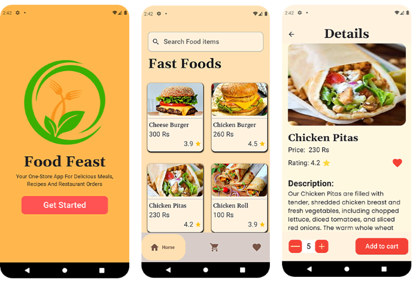
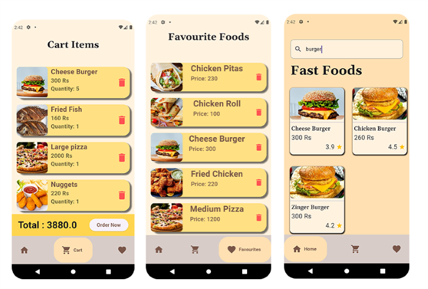

# 🍔 Food Feast
Food Feast is a beautifully designed Flutter application that provides a smooth and interactive experience for browsing, selecting, and managing fast food items. Built with Provider for state management, the app allows users to add items to their cart, mark favorites, and remove them effortlessly.  

## ✨ Features  
- 📌 **Attractive UI** – A modern and user-friendly design  
- 🛒 **Cart Management** – Add and remove food items from the cart  
- ❤️ **Favorites List** – Save favorite food items for quick access  
- 🔄 **Smooth Interactions** – Seamless state updates with Provider  

##  📱 Screeshots:

#

